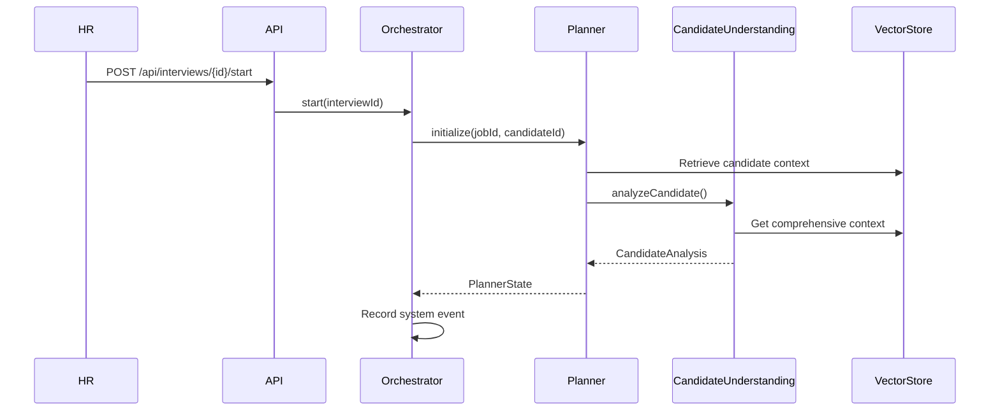
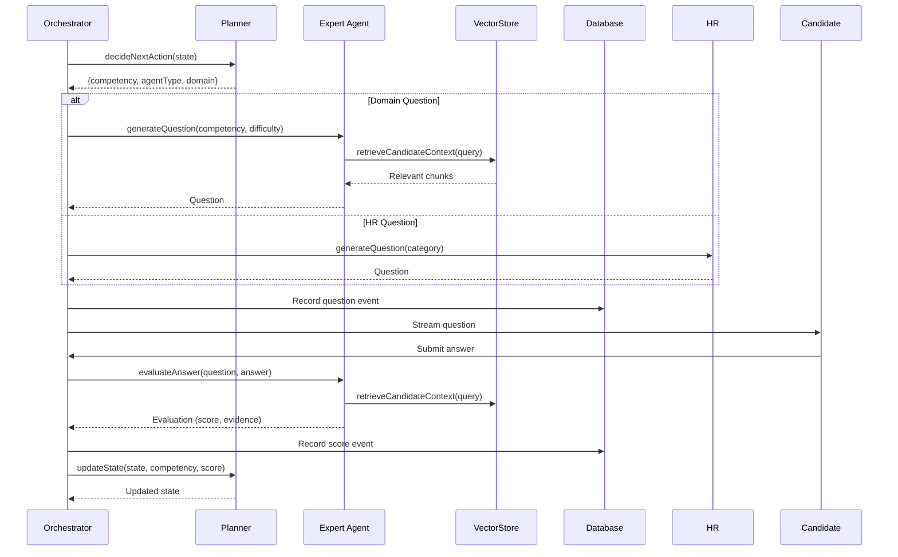
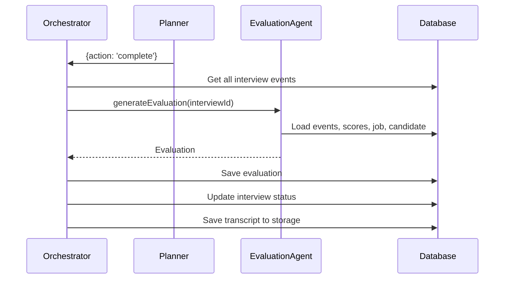

# Agent System (DeepAgents)

The InterviewOS agent system is a multi-agent orchestration framework that conducts intelligent interviews using specialized AI agents. This document describes the agent architecture, responsibilities, and interaction patterns.

## Agent Architecture

The system uses a hierarchical agent structure where a **Planner Agent** orchestrates specialized **Expert Agents** and an **HR Agent** to conduct comprehensive interviews.

```
┌─────────────────────────────────────────────────────────────┐
│                    InterviewOrchestrator                     │
│              (Manages interview lifecycle)                   │
└───────────────────────────┬─────────────────────────────────┘
                            │
                            ▼
┌─────────────────────────────────────────────────────────────┐
│                      PlannerAgent                            │
│  - Initializes interview state                              │
│  - Decides next competency to probe                         │
│  - Chooses appropriate agent (domain vs HR)                 │
│  - Determines when to complete interview                    │
└───────────────────────────┬─────────────────────────────────┘
                            │
        ┌───────────────────┼───────────────────┐
        │                   │                   │
        ▼                   ▼                   ▼
┌──────────────┐  ┌──────────────┐  ┌──────────────┐
│Expert Agents │  │  HR Agent    │  │Evaluation    │
│              │  │              │  │   Agent      │
│- Backend     │  │- Behavioral  │  │              │
│- Frontend    │  │  Questions   │  │- Synthesizes │
│- ML          │  │- Cultural Fit│  │  Results     │
│- Generic     │  │              │  │- Recommends  │
└──────────────┘  └──────────────┘  └──────────────┘
```

## Core Agents

### 1. PlannerAgent

**Location**: `src/lib/agents/planner-agent.ts`

**Responsibilities**:
- Initialize interview state from job and candidate data
- Analyze candidate profile using CandidateUnderstandingAgent
- Decide which competency to probe next
- Choose between domain expert or HR agent
- Determine interview completion criteria
- Maintain interview state and progress tracking

**Key Methods**:
- `initialize(jobId, candidateId, difficultyOverride?)` - Sets up interview state
- `decideNextAction(state, jobId, candidateId)` - Determines next interview step
- `updateState(state, competency, score)` - Updates state after question-answer cycle

**State Management**:
```typescript
interface PlannerState {
  competencies: Array<{
    name: string;
    covered: boolean;
    score: number | null;
    questionsAsked: number;
  }>;
  currentCompetency: string | null;
  questionCount: number;
  maxQuestions: number;
  difficulty: 'junior' | 'mid' | 'senior' | 'staff';
  candidateAnalysis?: CandidateAnalysis;
  jobDomain?: string;
}
```

**Decision Logic**:
The planner uses LLM reasoning to:
1. Identify uncovered competencies
2. Assess candidate performance on covered areas
3. Decide whether to probe deeper or move on
4. Balance technical and behavioral questions
5. Determine when sufficient information is gathered

### 2. ExpertDomainAgent (Base)

**Location**: `src/lib/agents/expert-agent.ts`

**Responsibilities**:
- Generate technical questions based on competency and difficulty
- Evaluate candidate answers with evidence-based scoring
- Provide recommendations for follow-up questions
- Use RAG to retrieve relevant candidate context

**Key Methods**:
- `generateQuestion(competency, difficulty, candidateId, jobContext?)` - Creates tailored questions
- `evaluateAnswer(question, answer, candidateId)` - Scores answers with evidence

**Specialized Expert Agents**:

#### BackendExpertAgent
**Location**: `src/lib/agents/backend-expert-agent.ts`

**Domain Expertise**:
- System design and architecture
- API design (REST, GraphQL, gRPC)
- Database design and optimization
- Distributed systems and microservices
- Caching strategies
- Message queues and event-driven architecture
- Security and authentication
- Performance optimization
- Scalability patterns
- Cloud infrastructure

#### FrontendExpertAgent
**Location**: `src/lib/agents/frontend-expert-agent.ts`

**Domain Expertise**:
- Modern JavaScript/TypeScript
- React, Vue, Angular frameworks
- State management
- Component architecture
- Performance optimization
- Web accessibility
- CSS and styling
- Build tools and bundlers
- Testing frameworks
- Browser APIs
- Progressive Web Apps

#### MLExpertAgent
**Location**: `src/lib/agents/ml-expert-agent.ts`

**Domain Expertise**:
- Machine learning fundamentals
- Deep learning architectures
- Model training and evaluation
- Feature engineering
- Hyperparameter tuning
- ML frameworks (TensorFlow, PyTorch)
- MLOps and deployment
- NLP and computer vision
- Model interpretability
- Production ML systems

#### ExpertAgentFactory
**Location**: `src/lib/agents/expert-agent-factory.ts`

Routes to appropriate expert agent based on:
- Explicit domain parameter
- Competency name inference
- Tech stack analysis
- Job requirements

### 3. HRBehavioralAgent

**Location**: `src/lib/agents/hr-agent.ts`

**Responsibilities**:
- Select behavioral questions from configurable library
- Adapt questions to candidate/job context
- Evaluate answers using behavioral rubrics
- Assess communication, teamwork, problem-solving, and cultural fit

**Key Methods**:
- `generateQuestion(category?, candidateContext?)` - Selects and adapts behavioral questions
- `evaluateAnswer(question, answer)` - Evaluates using STAR method and behavioral criteria

**Question Library**:
Stored in `hr_config` table with key `behavioral_questions`. Questions are categorized by:
- Problem-solving
- Teamwork
- Leadership
- Communication
- Cultural fit
- Conflict resolution

### 4. EvaluationAgent

**Location**: `src/lib/agents/evaluation-agent.ts`

**Responsibilities**:
- Synthesize all interview events and scores
- Generate comprehensive evaluation summary
- Provide clear hiring recommendation
- Create candidate-friendly summary (without sensitive details)

**Key Methods**:
- `generateEvaluation(interviewId)` - Creates final evaluation from all interview data

**Output Format**:
```typescript
interface Evaluation {
  scores: Record<string, number>; // competency -> score
  summary: string; // Full HR summary
  candidateSummary?: string; // Sanitized for candidate
  recommendation: 'strong_yes' | 'yes' | 'no' | 'strong_no';
}
```

### 5. CandidateUnderstandingAgent

**Location**: `src/lib/agents/candidate-understanding-agent.ts`

**Responsibilities**:
- Analyze candidate profile from all ingested data
- Identify strengths and potential risks
- Determine appropriate interview difficulty level
- Provide comprehensive candidate summary for planner

**Key Methods**:
- `analyzeCandidate(candidateId, jobId)` - Comprehensive candidate analysis

**Output**:
```typescript
interface CandidateAnalysis {
  strengths: string[];
  risks: string[];
  recommendedDifficulty: 'junior' | 'mid' | 'senior' | 'staff';
  summary: string;
  experienceLevel: string;
  keyTechnologies: string[];
}
```

### 6. JobUnderstandingAgent

**Location**: `src/lib/agents/job-understanding-agent.ts`

**Responsibilities**:
- Extract structured competencies from job descriptions
- Identify required tech stack
- Determine overall role level
- Classify domain (backend, frontend, ml, etc.)

**Key Methods**:
- `normalizeJobDescription(description)` - Converts raw JD to structured format

**Output**:
```typescript
interface NormalizedJob {
  competencies: Array<{
    name: string;
    weight: number;
    level: string;
  }>;
  level: string;
  techStack: string[];
  requirements: string[];
  domain?: string;
}
```

## Base Agent Class

**Location**: `src/lib/agents/base-agent.ts`

All agents inherit from `BaseAgent`, which provides:

### Core Functionality

1. **LLM Integration**: Wraps Google Gemini API
2. **Message Formatting**: Converts to Gemini format
3. **Tool Support**: Function calling capabilities
4. **JSON Response Parsing**: Structured output handling

### Key Methods

- `execute(messages, tools?)` - Execute agent with messages and optional tools
- `executeJSON<T>(messages, schema?)` - Execute and parse JSON response

### System Prompts

Each agent has a specialized system prompt that defines:
- Role and responsibilities
- Expertise areas
- Evaluation criteria
- Output format expectations

## Interview Flow

### Initialization Phase



### Question-Answer Cycle



### Completion Phase



## RAG Integration

All expert agents use RAG (Retrieval-Augmented Generation) to retrieve relevant candidate context:

### Context Retrieval Flow

1. **Query Generation**: Agent creates semantic query based on competency
2. **Embedding Generation**: Query is embedded using Gemini `text-embedding-004`
3. **Vector Search**: Similarity search in `candidate_embeddings` table
4. **Context Assembly**: Top-k relevant chunks are retrieved
5. **Question Generation**: Agent uses context to generate tailored questions

### Example Query Patterns

- "What is the candidate's experience with system design?"
- "Evidence about candidate's knowledge of React"
- "Candidate's backend development experience"

## Agent Configuration

### Difficulty Levels

- **Junior**: Basic concepts, simple scenarios
- **Mid**: Practical application, common patterns
- **Senior**: Complex systems, trade-offs, scalability
- **Staff**: Architecture decisions, cross-cutting concerns, leadership

### Question Generation Strategy

1. **Context-Aware**: Uses candidate's actual experience from RAG
2. **Difficulty-Matched**: Adjusts complexity based on candidate level
3. **Job-Relevant**: Aligns with job requirements and tech stack
4. **Progressive**: Can probe deeper based on answers

### Evaluation Criteria

**Technical Questions**:
- Correctness of answer
- Depth of understanding
- Practical application knowledge
- Trade-off awareness
- Evidence from candidate's background

**Behavioral Questions**:
- STAR method usage (Situation, Task, Action, Result)
- Clear communication
- Relevant experience
- Problem-solving approach
- Cultural fit indicators

## Extending the Agent System

### Adding a New Expert Agent

1. Create new agent class extending `BaseAgent`
2. Define domain-specific system prompt
3. Implement `generateQuestion()` and `evaluateAnswer()` methods
4. Add to `ExpertAgentFactory` routing logic
5. Update domain inference logic if needed

### Example: Adding DevOps Expert Agent

```typescript
export class DevOpsExpertAgent extends BaseAgent {
  constructor() {
    super(`You are a DevOpsExpertAgent specializing in...`);
  }
  
  async generateQuestion(...) { /* implementation */ }
  async evaluateAnswer(...) { /* implementation */ }
}
```

### Customizing HR Questions

1. Add questions to `hr_config` table
2. Structure with categories and metadata
3. HR agent will automatically use new questions

## Performance Considerations

### LLM Usage

- **Model Selection**: Uses Gemini 2.0 Flash for speed, Pro for complex reasoning
- **Token Management**: Efficient prompt engineering to minimize tokens
- **Caching**: Consider caching common question patterns

### RAG Performance

- **Embedding Generation**: Batch processing for multiple chunks
- **Vector Search**: HNSW index for fast similarity search
- **Context Window**: Limits retrieved chunks to top-k (default: 5)

### State Management

- **In-Memory State**: Planner state stored in memory during interview
- **Persistence**: All events persisted to database for recovery
- **Cleanup**: State cleared after interview completion

## Error Handling

### Agent Failures

- **Retry Logic**: Automatic retries for transient failures
- **Fallback**: Generic expert agent if domain agent fails
- **Error Events**: System events recorded for debugging

### LLM Errors

- **Rate Limiting**: Respects API rate limits
- **Timeout Handling**: Configurable timeouts for LLM calls
- **Graceful Degradation**: Falls back to simpler prompts if needed

## References

- [Architecture Overview](./architecture.md) - System architecture
- [API Documentation](./api.md) - Interview API endpoints
- [Database Schema](./database.md) - Agent-related tables

