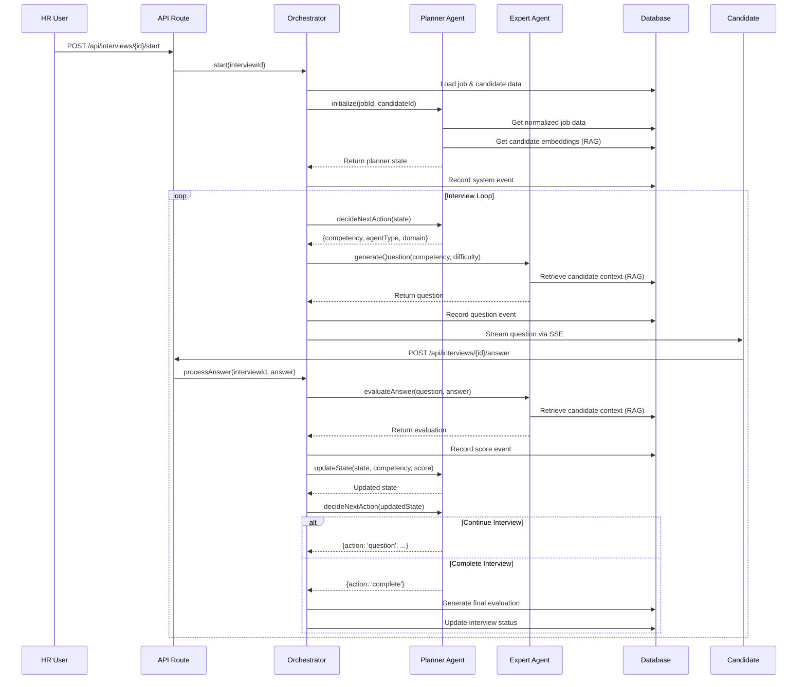

# Architecture Overview

This document describes the overall architecture of InterviewOS, including system components, data flow, and design decisions.

## System Architecture

InterviewOS follows a serverless architecture pattern with Next.js handling both frontend and backend through API routes. The system is designed for single-deployment simplicity while maintaining scalability.

### High-Level Architecture

```
┌─────────────────────────────────────────────────────────────────┐
│                         Client Layer                            │
│  ┌──────────────┐  ┌──────────────┐  ┌──────────────┐         │
│  │ HR Dashboard │  │Candidate UI  │  │ Public Pages │         │
│  │  (Next.js)   │  │  (Next.js)   │  │  (Next.js)   │         │
│  └──────────────┘  └──────────────┘  └──────────────┘         │
└─────────────────────────────────────────────────────────────────┘
                            │
                            │ HTTP/SSE
                            ▼
┌─────────────────────────────────────────────────────────────────┐
│                    Next.js Application Layer                    │
│  ┌──────────────────────────────────────────────────────────┐  │
│  │              API Routes (Serverless Functions)            │  │
│  │  /api/jobs  /api/candidates  /api/interviews  /api/*     │  │
│  └──────────────────────────────────────────────────────────┘  │
│  ┌──────────────────────────────────────────────────────────┐  │
│  │              Middleware (Auth & Routing)                  │  │
│  │  - Session validation                                     │  │
│  │  - Role-based routing                                     │  │
│  └──────────────────────────────────────────────────────────┘  │
└─────────────────────────────────────────────────────────────────┘
                            │
                            │
        ┌───────────────────┼───────────────────┐
        │                   │                   │
        ▼                   ▼                   ▼
┌──────────────┐  ┌──────────────┐  ┌──────────────┐
│ Agent System │  │  Ingestion   │  │  RAG/Vector  │
│ Orchestrator │  │   Services   │  │    Store     │
└──────────────┘  └──────────────┘  └──────────────┘
        │                   │                   │
        └───────────────────┼───────────────────┘
                            │
                            ▼
┌─────────────────────────────────────────────────────────────────┐
│                      Supabase Platform                          │
│  ┌──────────────┐  ┌──────────────┐  ┌──────────────┐         │
│  │ PostgreSQL   │  │  pgvector    │  │   Storage    │         │
│  │  (Database)  │  │  (Embeddings)│  │  (Artifacts) │         │
│  └──────────────┘  └──────────────┘  └──────────────┘         │
│  ┌──────────────┐  ┌──────────────┐                           │
│  │   Auth       │  │  Realtime    │                           │
│  │  (Sessions)  │  │  (SSE/Subs)  │                           │
│  └──────────────┘  └──────────────┘                           │
└─────────────────────────────────────────────────────────────────┘
                            │
                            │
                            ▼
┌─────────────────────────────────────────────────────────────────┐
│                    External Services                            │
│  ┌──────────────┐  ┌──────────────┐  ┌──────────────┐         │
│  │   Gemini AI  │  │   GitHub API │  │  (Optional)  │         │
│  │  (LLM/Embed) │  │   (Repos)    │  │  Voice APIs  │         │
│  └──────────────┘  └──────────────┘  └──────────────┘         │
└─────────────────────────────────────────────────────────────────┘
```

## Core Components

### 1. Frontend Layer

**Location**: `src/app/`

- **Dashboard Pages**: HR and Candidate interfaces
- **API Routes**: Serverless backend functions
- **Components**: Reusable UI components (shadcn/ui)
- **Hooks**: React hooks for data fetching and state management

**Key Features**:
- Server-Side Rendering (SSR) for SEO and performance
- Client-side interactivity with React
- Real-time updates via Server-Sent Events (SSE)
- Role-based UI rendering

### 2. API Layer

**Location**: `src/app/api/`

All backend logic is implemented as Next.js API routes, which run as serverless functions on Vercel.

**Main Endpoints**:
- `/api/jobs` - Job management
- `/api/candidates` - Candidate management
- `/api/interviews` - Interview orchestration
- `/api/profiles` - User profile management

**Design Pattern**:
- RESTful API design
- JSON request/response format
- Server-side authentication via Supabase
- Error handling with consistent response format

### 3. Agent System

**Location**: `src/lib/agents/`

The multi-agent system orchestrates interviews using specialized AI agents. See [Agent System Documentation](./agents.md) for detailed information.

**Key Components**:
- `orchestrator.ts` - Main interview flow controller
- `planner-agent.ts` - Decides interview strategy
- `expert-agent.ts` - Technical question generation
- `hr-agent.ts` - Behavioral question generation
- `evaluation-agent.ts` - Final evaluation synthesis

### 4. Ingestion Services

**Location**: `src/lib/ingestion/`

Processes and indexes candidate and job data for use in interviews.

**Services**:
- `job-ingestion.ts` - Normalizes job descriptions
- `candidate-ingestion.ts` - Orchestrates candidate data collection
- `resume-parser.ts` - Extracts text from PDF/text resumes
- `github-service.ts` - Fetches GitHub repository data
- `portfolio-scraper.ts` - Scrapes portfolio websites
- `linkedin-service.ts` - LinkedIn data extraction (structure ready)

### 5. RAG/Vector Store

**Location**: `src/lib/rag/`

Implements Retrieval-Augmented Generation for candidate context retrieval.

**Components**:
- `vector-store.ts` - Embedding generation and similarity search
- Uses Gemini `text-embedding-004` model (768 dimensions)
- Stores embeddings in Supabase pgvector extension
- Enables semantic search over candidate data

### 6. Database Layer

**Location**: `supabase/migrations/`

PostgreSQL database with pgvector extension for vector similarity search.

**Key Tables**:
- `jobs` - Job descriptions and normalized data
- `candidates` - Candidate profiles
- `interviews` - Interview sessions
- `interview_events` - Event log for interviews
- `evaluations` - Final interview evaluations
- `candidate_embeddings` - Vector embeddings for RAG
- `profiles` - User profiles with roles

See [Database Schema](./database.md) for detailed information.

## Data Flow

### Interview Flow Sequence



### Candidate Ingestion Flow

```mermaid
flowchart TD
    A[HR Creates Candidate] --> B[POST /api/candidates]
    B --> C[HR Triggers Ingestion]
    C --> D[POST /api/candidates/{id}/ingest]
    D --> E[CandidateIngestionService]
    
    E --> F{Resume URL?}
    F -->|Yes| G[ResumeParser]
    G --> H[Extract Text & Sections]
    
    E --> I{LinkedIn URL?}
    I -->|Yes| J[LinkedInService]
    J --> K[Extract Profile Data]
    
    E --> L{GitHub Username?}
    L -->|Yes| M[GitHubService]
    M --> N[Fetch Repos & READMEs]
    
    E --> O{Portfolio URL?}
    O -->|Yes| P[PortfolioScraper]
    P --> Q[Scrape Multiple Pages]
    
    H --> R[VectorStore]
    K --> R
    N --> R
    Q --> R
    
    R --> S[Generate Embeddings]
    S --> T[Store in candidate_embeddings]
    T --> U[Store Artifacts in Supabase Storage]
```

## Security Architecture

### Authentication & Authorization

1. **Supabase Auth**: Handles user authentication
2. **Row Level Security (RLS)**: Database-level access control
3. **Role-Based Access Control (RBAC)**: HR and Candidate roles
4. **Middleware**: Route protection and role-based routing

### Security Layers

```
┌─────────────────────────────────────┐
│   Client Request                    │
└──────────────┬──────────────────────┘
               │
               ▼
┌─────────────────────────────────────┐
│   Next.js Middleware                │
│   - Session validation              │
│   - Role-based routing              │
└──────────────┬──────────────────────┘
               │
               ▼
┌─────────────────────────────────────┐
│   API Route Handler                 │
│   - getSessionWithProfile()         │
│   - Role verification               │
└──────────────┬──────────────────────┘
               │
               ▼
┌─────────────────────────────────────┐
│   Supabase Client                   │
│   - RLS policies enforced           │
│   - Service role for admin ops      │
└─────────────────────────────────────┘
```

### Data Privacy

- Candidate data is only accessible to:
  - The candidate themselves
  - HR users (for interview purposes)
- Interview data is protected by RLS policies
- Embeddings are stored securely in the database
- Artifacts are stored in private Supabase Storage buckets

## Scalability Considerations

### Current Architecture

- **Serverless Functions**: Auto-scaling on Vercel
- **Database**: Supabase managed PostgreSQL
- **Vector Search**: pgvector with HNSW indexing
- **Storage**: Supabase Storage with CDN

### Performance Optimizations

1. **Vector Indexing**: HNSW index on embeddings for fast similarity search
2. **Database Indexes**: Composite indexes on common query patterns
3. **Caching**: Consider adding Redis for frequently accessed data
4. **CDN**: Static assets served via Vercel CDN

### Future Scalability Options

- **Horizontal Scaling**: Add read replicas for database
- **Caching Layer**: Redis for session and frequently accessed data
- **Queue System**: Background job processing for ingestion
- **Microservices**: Split agents into separate services if needed

## Deployment Architecture

### Vercel Deployment

```
┌─────────────────────────────────────┐
│         Vercel Edge Network         │
│   (Global CDN + Edge Functions)     │
└──────────────┬──────────────────────┘
               │
               ▼
┌─────────────────────────────────────┐
│      Next.js Application            │
│   - SSR/SSG Pages                   │
│   - API Routes (Serverless)         │
│   - Static Assets                   │
└──────────────┬──────────────────────┘
               │
               ▼
┌─────────────────────────────────────┐
│         Supabase Platform           │
│   - PostgreSQL Database             │
│   - Storage Buckets                 │
│   - Auth Service                    │
│   - Realtime Subscriptions          │
└─────────────────────────────────────┘
```

### Environment Configuration

- **Development**: Local Next.js dev server + Supabase project
- **Production**: Vercel deployment + Supabase production project
- **Environment Variables**: Managed in Vercel dashboard

## Design Decisions

### Why Serverless?

- **Cost Efficiency**: Pay only for actual usage
- **Auto-scaling**: Handles traffic spikes automatically
- **Simplicity**: Single deployment, no infrastructure management
- **Fast Cold Starts**: Next.js API routes have minimal cold start time

### Why Supabase?

- **PostgreSQL**: Robust relational database
- **pgvector**: Native vector similarity search
- **Auth**: Built-in authentication and RLS
- **Storage**: File storage for artifacts
- **Realtime**: Built-in subscriptions for SSE

### Why Multi-Agent System?

- **Modularity**: Each agent has a specific responsibility
- **Flexibility**: Easy to add new agent types
- **Maintainability**: Clear separation of concerns
- **Extensibility**: Can add domain-specific expert agents

## Monitoring & Observability

### Current State

- **Error Handling**: Try-catch blocks with error logging
- **Database Logs**: Supabase dashboard for query performance
- **Vercel Logs**: Function execution logs

### Recommended Additions

- **Application Monitoring**: Sentry or similar for error tracking
- **Performance Monitoring**: Vercel Analytics
- **Database Monitoring**: Supabase query performance insights
- **Log Aggregation**: Centralized logging solution

## References

- [Agent System](./agents.md) - Detailed agent documentation
- [API Documentation](./api.md) - API endpoint details
- [Database Schema](./database.md) - Database structure
- [Deployment Guide](./deployment.md) - Deployment instructions

