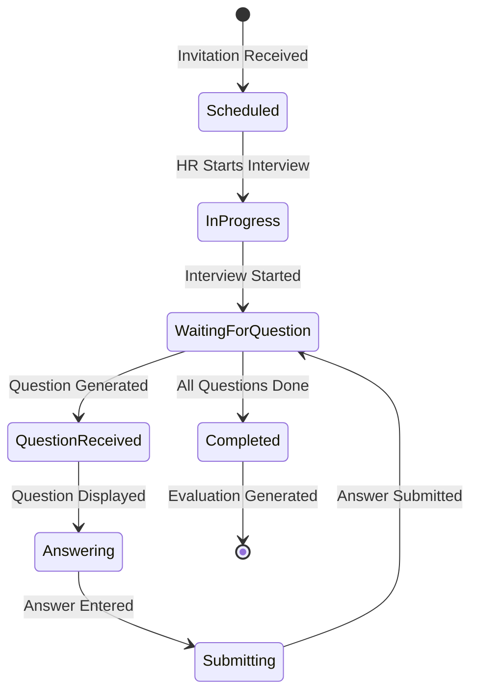

# Candidate Flow

This document describes the candidate user journey through InterviewOS, from receiving an invitation to viewing evaluation results.

## Candidate Journey Overview

```
┌─────────────┐
│  Invitation │
│  Received   │
└──────┬──────┘
       │
       ▼
┌─────────────┐
│   Sign Up   │
│   / Login   │
└──────┬──────┘
       │
       ▼
┌─────────────┐
│ View Invite │
│  Details    │
└──────┬──────┘
       │
       ▼
┌─────────────┐
│  Interview  │
│   Session   │
└──────┬──────┘
       │
       ▼
┌─────────────┐
│ Evaluation  │
│   Results   │
└─────────────┘
```

## 1. Invitation Reception

### Email/Notification

Candidates receive an interview invitation containing:
- Interview link: `/interview/{interview-id}`
- Job title and description
- Interview mode (chat or voice)
- Scheduled date/time (if applicable)

### Public Invitation Page

**Route**: `/interview/[id]`

**Location**: `src/app/interview/[id]/page.tsx`

**Features**:
- View interview details without authentication
- See job description and requirements
- View key competencies
- See interview mode (chat/voice)
- Company and HR information

**Actions Available**:
- **Accept & Attend**: Redirects to login/signup
- **Sign Up First**: Creates account then redirects
- **View Results**: If interview is completed

## 2. Authentication

### Sign Up Flow

**Route**: `/signup`

**Location**: `src/app/(auth)/signup/page.tsx`

**Process**:
1. Candidate provides email and password
2. Optionally provides full name and resume URL
3. Account created with role: `candidate`
4. Profile created in `profiles` table
5. Redirected to candidate dashboard

### Login Flow

**Route**: `/login`

**Location**: `src/app/(auth)/login/page.tsx`

**Process**:
1. Candidate enters email and password
2. Supabase Auth validates credentials
3. Session established
4. Redirected to candidate dashboard or interview page

### Profile Creation

**Database**: `profiles` table

**Fields**:
- `id`: UUID (linked to auth.users)
- `role`: `'candidate'`
- `full_name`: Optional
- `company`: Optional (usually null for candidates)
- `resume_url`: Optional

**Trigger**: Automatically created on signup via database trigger

## 3. Candidate Dashboard

**Route**: `/dashboard/candidate`

**Location**: `src/app/dashboard/candidate/page.tsx`

**Features**:
- List of all interviews assigned to candidate
- Interview status (scheduled, in_progress, completed)
- Quick access to active interviews
- View evaluation results

**Access Control**:
- Only accessible to users with `role = 'candidate'`
- Shows only interviews where `candidates.user_id = auth.uid()`
- Enforced by middleware and RLS policies

## 4. Interview Session

### Interview Page

**Route**: `/dashboard/candidate/interviews/[id]`

**Location**: `src/app/dashboard/candidate/interviews/[id]/page.tsx`

### Interview Flow



### Real-Time Updates

**Technology**: Server-Sent Events (SSE)

**Endpoint**: `GET /api/interviews/[id]/stream`

**Events Streamed**:
- `question` - New question received
- `score` - Answer evaluated and scored
- `system` - Interview state changes

**Implementation**: Uses Supabase Realtime subscriptions to listen for new `interview_events`

### Question Display

**UI Components**:
- Question text
- Competency badge
- Difficulty indicator
- Expected answer hints (optional)

**Answer Input**:
- Text area for chat mode
- Voice recording for voice mode (future)
- Submit button

### Answer Submission

**Endpoint**: `POST /api/interviews/[id]/answer`

**Request Body**:
```json
{
  "answer": "Candidate's answer text",
  "question_id": "event-id-of-question"
}
```

**Process**:
1. Answer recorded as `interview_events` with type `answer`
2. Orchestrator processes answer through appropriate agent
3. Answer evaluated and scored
4. Score event recorded
5. Next question generated or interview completed

### Interview Status Indicators

- **Scheduled**: Interview created but not started
- **In Progress**: Interview active, questions being asked
- **Completed**: Interview finished, evaluation available
- **Cancelled**: Interview cancelled by HR

## 5. Evaluation Results

### Viewing Results

**Access**: Available after interview completion

**Location**: Same interview page, evaluation section appears

**Content**:
- **Recommendation**: `strong_yes`, `yes`, `no`, `strong_no`
- **Candidate Summary**: Encouraging, constructive feedback
- **Scores**: Per-competency scores (optional display)
- **Full Summary**: Detailed evaluation (HR-only, not shown to candidate)

### Candidate Summary Format

The candidate summary is specifically crafted to be:
- **Positive and Constructive**: Focuses on strengths
- **Growth-Oriented**: Suggests areas for improvement
- **Professional**: Maintains professional tone
- **No Sensitive Details**: Excludes specific scores or negative details

### Evaluation Data Structure

```typescript
interface Evaluation {
  scores: Record<string, number>; // competency -> score (0-1)
  summary: string; // Full HR summary
  candidateSummary: string; // Candidate-friendly summary
  recommendation: 'strong_yes' | 'yes' | 'no' | 'strong_no';
}
```

## Candidate Profile Management

### Profile Page

**Route**: `/dashboard/candidate/profile` (if implemented)

**Features**:
- View profile information
- Update full name
- Update resume URL
- View linked candidate record (if exists)

### Candidate Record

**Table**: `candidates`

**Relationship**: `candidates.user_id` links to `auth.users.id`

**Fields**:
- `name`: Candidate name
- `email`: Email address
- `links`: JSON object with LinkedIn, GitHub, portfolio URLs
- `resume_url`: Resume file URL

**Note**: Candidates may have a record created by HR, or can create their own

## Data Ingestion (Candidate Side)

### Automatic Ingestion

When HR creates a candidate and triggers ingestion:
- Resume parsed and indexed
- GitHub repositories fetched
- Portfolio scraped
- LinkedIn data extracted (if available)
- All data embedded and stored in vector store

### Candidate Data Sources

1. **Resume**: PDF or text file
   - Parsed into sections (experience, education, skills, etc.)
   - Chunked for RAG indexing

2. **GitHub**: Username or profile URL
   - Repositories fetched via GitHub API
   - README files extracted
   - Repository metadata indexed

3. **Portfolio**: Website URL
   - Multi-page scraping
   - Text content extracted
   - Structured data indexed

4. **LinkedIn**: Profile URL
   - Structure ready for API/scraping service
   - Currently placeholder implementation

## Interview Experience

### Chat Mode

**Interface**:
- Question displayed in card
- Text area for answer
- Submit button
- Real-time event stream showing progress

**Advantages**:
- Can take time to think
- Can edit answer before submitting
- Clear text-based communication

### Voice Mode (Future)

**Planned Features**:
- Voice-to-text transcription
- Text-to-speech for questions
- Real-time audio streaming
- Video recording (optional)

**Implementation**: Uses browser Web Speech API or external services (ElevenLabs, Google Speech)

## Security & Privacy

### Data Access

- Candidates can only view their own interviews
- RLS policies enforce data isolation
- Evaluation summaries are sanitized for candidate view

### Interview Data

- All interview events are logged
- Transcript saved to Supabase Storage
- Data retained for HR review and compliance

## Troubleshooting

### Common Issues

**Interview Not Starting**:
- Verify HR has started the interview
- Check interview status in dashboard
- Ensure candidate is logged in

**Questions Not Appearing**:
- Check SSE connection status
- Verify interview is in `in_progress` status
- Check browser console for errors

**Answer Not Submitting**:
- Verify answer is not empty
- Check network connection
- Ensure interview is still active

**Evaluation Not Showing**:
- Verify interview is completed
- Check if evaluation was generated
- Refresh page to load latest data

## References

- [HR Flow](./hr-flow.md) - HR-side interview management
- [API Documentation](./api.md) - Candidate-related endpoints
- [Agent System](./agents.md) - How interviews are conducted

